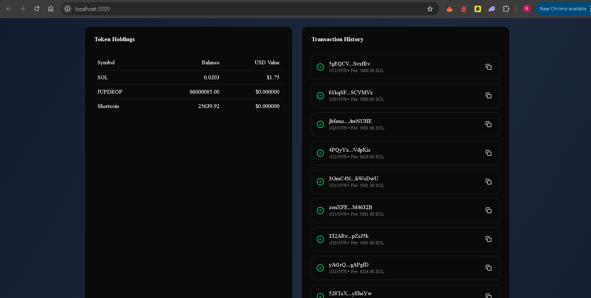

## Solana Wallet Tracker

A real time solana wallet analytics dashboard that tracks Token Balances, Transaction History and live onchain activity using raw Websockets.

## Tech stack

### Backend

- Node js
- Express
- Typescript
- WebSocket server(ws)
- REST API Architechture

### Blockchain & Data Infrsstructure
- Helius RPC API
- Helius WebSocket Streaming
- Solana JSON-RPC

### Frontend 
Vibe Coded

## API DESIGN

This project follows a versioned API architechture for future scalability and backward compatibility

### Versioned Endpoints

All routes are prefixed with: `/api/v1`.

Example Endpoints :
`GET /api/v1/:walletAddress/tokens`
`GET /api/v1/:walletAddress/transactions`

## Functionalities 

- Track any **Solana wallet address**
- View **token balances and portfolio value in USD**
- Fetch **recent transaction history**

- Display **timestamps, fees, and status**
- **Real-time transaction updates** using WebSockets
- Data powered by **Helius RPC**
- **Versioned REST API (`/api/v1`)** for scalable backend design

## Setup
fork this repo and clone it 
`git clone https://github.com/rajdeeprudra/Wallet-Tracker.git `

### backend Setup

 - `cd server`
 - `npm install`
 - `npm run dev`
 
### Frontend Setup

- `cd client`
- `npm install`
- Create a .env.local file in side client and there add the backend url as : `NEXT_PUBLIC_BACKEND_URL=http://localhost:4000`
- `npm run dev`
After that the app will run

